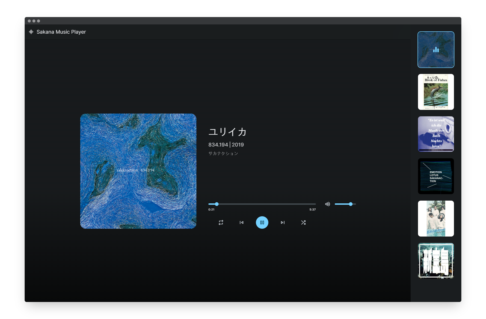

<div align="center">
  
  
  
  
  [](https://twitter.com/intent/follow?screen_name=yandao0313)

  <br />
  
  <br />

  <h1 align="center">Sakana Music Player</h2>

  A fully responsive web music player using vanilla javascript, <br />Responsive for all devices, build using html, css, and javascript. <br />With songs by [Sakanaction](https://sakanaction.jp/).
  
  使用 vanilla javascript 的完全响应式网络音乐播放器<br />响应所有设备，使用 html、css 和 javascript 构建<br />配上 [Sakanaction](https://sakanaction.jp/) 的歌曲

  <a href="https://sakana-music-player.vercel.app/"><strong>➥ Live Demo - 在线演示</strong></a>
  
  <a href="https://music.xn--fhqw2khm122n.cn/"><strong>➥ China Live Demo - 在线演示 (中国大陆优化)</strong></a>
  
  ----------
  
  [](https://vercel.com/new/clone?repository-url=https%3A%2F%2Fgithub.com%2FYanDao0313%2FSakanaMusicPlayer&project-name=SakanaMusicPlayer&repository-name=SakanaMusicPlayer&demo-title=Sakana%20Music%20Player&demo-description=A%20fully%20responsive%20web%20music%20player%20using%20vanilla%20javascript.%20&demo-url=https%3A%2F%2Fsakana-music-player.vercel.app%2F&demo-image=https%3A%2F%2Fxingqiu-tuchuang-1256524210.cos.ap-shanghai.myqcloud.com%2F5115%2F20221128221852.png)
  
  Deploy Your Own Version With [Vercel](https://vercel.com/new/clone?repository-url=https%3A%2F%2Fgithub.com%2FYanDao0313%2FSakanaMusicPlayer&project-name=SakanaMusicPlayer&repository-name=SakanaMusicPlayer&demo-title=Sakana%20Music%20Player&demo-description=A%20fully%20responsive%20web%20music%20player%20using%20vanilla%20javascript.%20&demo-url=https%3A%2F%2Fsakana-music-player.vercel.app%2F&demo-image=https%3A%2F%2Fxingqiu-tuchuang-1256524210.cos.ap-shanghai.myqcloud.com%2F5115%2F20221128221852.png)<br />在 [Vercel](https://vercel.com/new/clone?repository-url=https%3A%2F%2Fgithub.com%2FYanDao0313%2FSakanaMusicPlayer&project-name=SakanaMusicPlayer&repository-name=SakanaMusicPlayer&demo-title=Sakana%20Music%20Player&demo-description=A%20fully%20responsive%20web%20music%20player%20using%20vanilla%20javascript.%20&demo-url=https%3A%2F%2Fsakana-music-player.vercel.app%2F&demo-image=https%3A%2F%2Fxingqiu-tuchuang-1256524210.cos.ap-shanghai.myqcloud.com%2F5115%2F20221128221852.png) 上发布您自己的版本

</div>

<br />

## Demo Screeshots - 屏幕截图



> [Demo Video - 演示视频](https://youtu.be/izUETrfEoMs)

## Prerequisites - 先决条件

Before you begin, ensure you have met the following requirements:

* [Git](https://git-scm.com/downloads "Download Git") must be installed on your operating system.

在你开始之前，你的设备必须满足以下条件：

* [Git](https://git-scm.com/downloads "Download Git") 必须在你的操作环境上已安装好。

## Run Locally - 本地运行

To run **Sakana Music Player** locally, run this command on your git bash:

为了在本地运行 **Sakana Music Player** ，请在终端中执行以下命令：

Linux & macOS:

```bash
sudo git clone https://github.com/YanDao0313/SakanaMusicPlayer.git
```

Windows:

```bash
git clone https://github.com/YanDao0313/SakanaMusicPlayer.git
```

## License - 协议

This project is **Under the MIT License**. 

本项目使用**MIT开源协议**。
