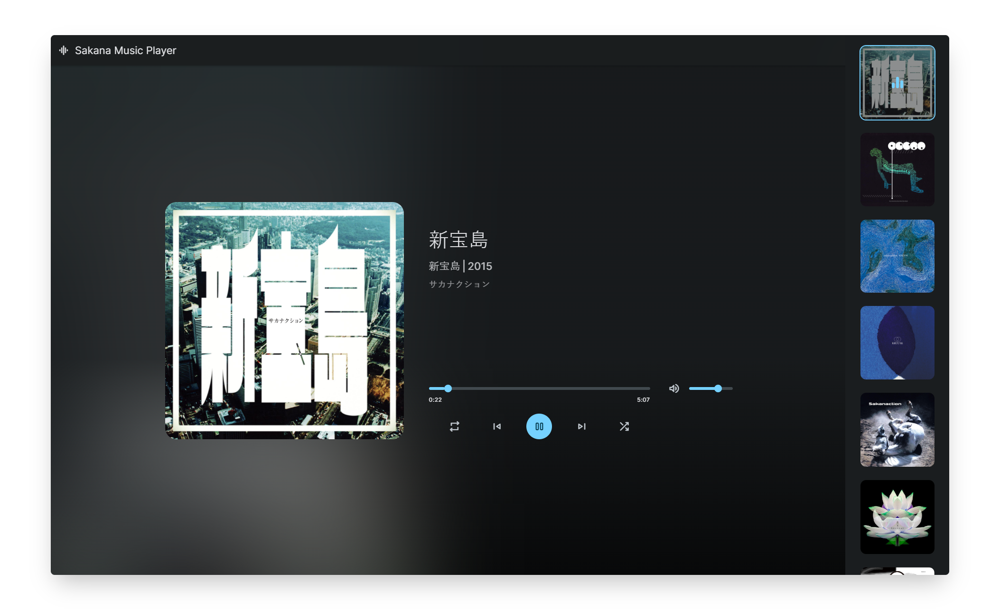

  
  

  Languages: [English](./en/) | [简体中文](./zh_hans/)

  # Sakana Music Player

  A fully responsive web music player using vanilla javascript,  Responsive for all devices, build using html, css, and javascript.  With songs by [Sakanaction](https://sakanaction.jp/).

  使用 vanilla javascript 的响应式网络音乐播放器 响应所有设备，使用 html、css 和 javascript 构建 配上 [Sakanaction](https://sakanaction.jp/) 的歌曲

  <a href="https://smp.is-an.app/"><strong>➥ Live Demo (gh-pages)</strong></a>
  
  <a href="https://smp.rth.app/"><strong>➥ Mainland-China-friendly Live Demo</strong></a>
  
  ----------
  
  
  
  Deploy Your Own Version With [Vercel](https://vercel.com/new/clone?repository-url=https%3A%2F%2Fgithub.com%2Fvercel%2Fnext.js%2Ftree%2Fcanary%2Fexamples%2Fhello-world&project-name=sakana-music-player&repository-name=SakanaMusicPlayer&demo-title=Sakana%20Music%20Player&demo-description=A%20fully%20responsive%20web%20music%20player%20with%20songs%20by%20Sakanaction.&demo-url=https%3A%2F%2Fsmp.is-an.app&demo-image=https%3A%2F%2Fxingqiu-tuchuang-1256524210.cos.ap-shanghai.myqcloud.com%2F5115%2F20221128221852.png)

  在 [Vercel](https://vercel.com/new/clone?repository-url=https%3A%2F%2Fgithub.com%2Fvercel%2Fnext.js%2Ftree%2Fcanary%2Fexamples%2Fhello-world&project-name=sakana-music-player&repository-name=SakanaMusicPlayer&demo-title=Sakana%20Music%20Player&demo-description=A%20fully%20responsive%20web%20music%20player%20with%20songs%20by%20Sakanaction.&demo-url=https%3A%2F%2Fsmp.is-an.app&demo-image=https%3A%2F%2Fxingqiu-tuchuang-1256524210.cos.ap-shanghai.myqcloud.com%2F5115%2F20221128221852.png) 上发布您自己的版本

  ----------

  All Available Preview Websites
  
  gh-pages: [yandao0313.github.io](https://yandao0313.github.io/SakanaMusicPlayer/) | [smp.is-an.app](https://smp.is-an.app/)

  vercel: [sakana-music-player.vercel.app](https://sakana-music-player.vercel.app/) | [music.蒙古上单.cn](https://music.xn--fhqw2khm122n.cn/) | [smp.ydlk.cc](https://smp.ydlk.cc/)

  retiehe host (For Mainland China Viewers): [smp.rth.app](https://smp.rth.app/)

 

## Demo Screeshot - 屏幕截图

> [Demo Video - 演示视频](https://youtu.be/izUETrfEoMs)

## Feature - 特色内容

✅ A fully responsive web music player using vanilla javascript | 使用 vanilla javascript 的响应式网络音乐播放器

✅ Responsive for all devices, build using html, css, and javascript | 响应所有设备，使用 html、css 和 javascript 构建，纯静态页面

✅ With songs by [Sakanaction](https://sakanaction.jp/) | 配上 [Sakanaction](https://sakanaction.jp/) 的歌曲

✅ Now including awesome error pages (from [this project](https://github.com/tarampampam/error-pages)) | 新增美观的错误页面们 (来自 [此项目](https://github.com/tarampampam/error-pages))

✅ New - Comments are supported now, power by [waline](https://waline.js.org/) | 现在支持评论了！由 [waline](https://waline.js.org/) 驱动

## License - 协议

This project is **Under the MIT License**. 

本项目使用**MIT开源协议**。

## Thanks - 致谢

<!---
Source Code is based on the repo [music-player](https://github.com/codewithsadee/music-player) by @codewithsadee .
--->

The domain *smp.is-an.app* is power by [this project](https://github.com/tarampampam/free-domains).

<!---
源代码基于 @codewithsadee 的仓库：[music-player](https://github.com/codewithsadee/music-player) 。
--->

域名 *smp.is-an.app* 来自于 [此项目](https://github.com/tarampampam/free-domains).

----------

